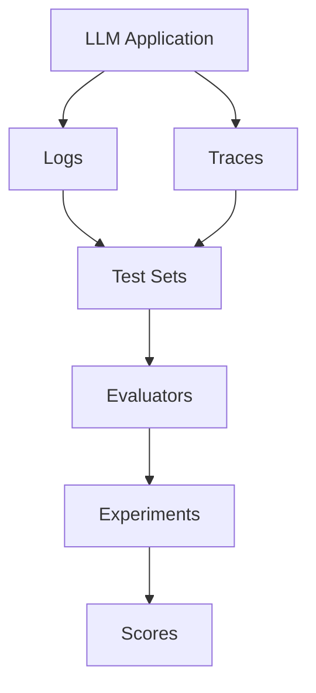

Keywords AI provides two main types of observability: **Traces** for agent workflows and **Logs** for LLM calls, plus a comprehensive **Evaluation** framework.

## Traces vs Logs

<CardGroup cols={2}>
<Card title="Logs" icon="file">
  **LLM call logging** - Individual requests and responses to language models
</Card>
<Card title="Traces" icon="route">
  **Agent tracking** - Complete workflows with multiple steps
</Card>
</CardGroup>

### Logs
<Info>
Logs record individual LLM API calls and responses
</Info>

- Single request/response pairs
- Token usage and costs
- Model performance metrics
- Error tracking
- Response latency

### Traces
<Info>
Traces capture the full execution flow of agent workflows
</Info>

- Multi-step agent processes
- Tool calls and function executions
- Decision-making steps
- Hierarchical workflow visualization
- Agent reasoning and planning

## Evaluation Framework

The evaluation system helps you assess and improve LLM performance through systematic testing.

### Test Sets
<Tip>
Curated collections of examples for evaluation
</Tip>

- Input/output pairs
- Expected responses
- Evaluation criteria
- Test case metadata

### Evaluators
<Tip>
Tools that assess LLM output quality
</Tip>

**Types of evaluators:**
- **LLM Evaluators**: AI-powered assessment
- **Human Evaluators**: Manual review
- **Rule-based**: Automated validation
- **Custom Metrics**: Domain-specific scoring

### Experiments
<Tip>
Comparative testing of different configurations
</Tip>

- A/B testing of prompts
- Model comparisons
- Performance benchmarking
- Cost analysis

### Scores
<Tip>
Quantitative and qualitative assessment results
</Tip>

- Numeric ratings (1-5, 1-10)
- Boolean pass/fail
- Categorical classifications
- Comments and feedback

## Data Flow

