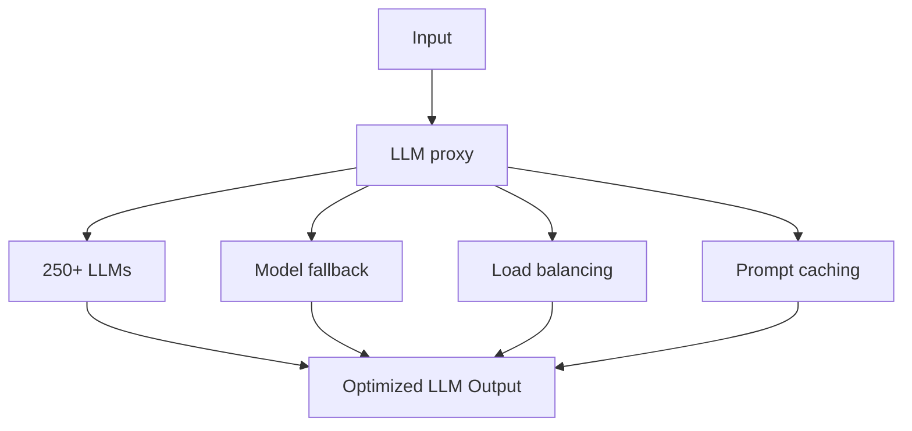

## Benefits of LLM proxy:
- Call over 250 LLMs using the same format.
- Ensure your LLM applications become more scalable and reliable.
- Manage LLM costs in a single place.
- Mange API keys in a single place without exposing them.

## Considerations:
- May not be suitable for products with strict latency requirements (**50 - 150ms** added).
- May not be ideal for those who do not want to integrate a third-party service into the core of their application.