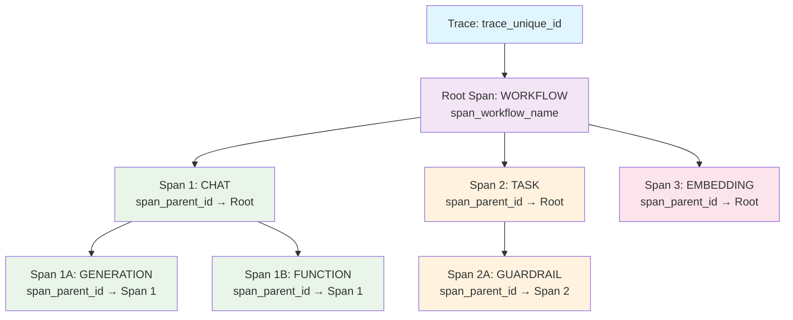
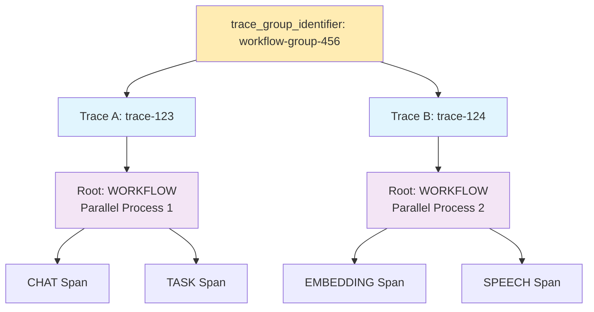

## Overview

Keywords AI's observability is built around one core concept: **different views of the same underlying data**. All views present the same log data, just organized differently for different use cases:

<CardGroup cols={2}>
<Card title="Logs" icon="list">
  **Plain view** - Individual LLM requests as they happen
</Card>
<Card title="Traces" icon="route">
  **Hierarchical view** - Multi-step workflows and AI agent operations
</Card>
<Card title="Threads" icon="messages">
  **Conversational view** - Linear chat interface for dialogue systems
</Card>
<Card title="Scores" icon="chart-line">
  **Evaluation view** - Quality assessments and performance metrics
</Card>
</CardGroup>

<Warning>
All four views show the **same underlying data** - they just organize and present it differently. The core data structure remains consistent across all views.
</Warning>

## Logs

<Info>
A log represents a single LLM request and contains all the information about that interaction. This is the foundational data that powers all other views.
</Info>

### Core fields

<AccordionGroup>
<Accordion title="Request data" icon="arrow-right">
- **Prompt**: The input sent to the LLM
- **Model**: Which LLM model was used
- **Parameters**: Temperature, max tokens, etc.
</Accordion>

<Accordion title="Response data" icon="arrow-left">
- **Response**: The output generated by the LLM
- **Tokens**: Input, output, and total token counts
- **Finish reason**: How the generation ended
</Accordion>

<Accordion title="Metadata" icon="info">
- **Cost**: Calculated cost for the request
- **Latency**: Response time in milliseconds
- **Timestamp**: When the request was made
- **Status**: Success, error, or other states
- **Customer ID**: User identifier
- **API key**: Which key was used
</Accordion>
</AccordionGroup>

### Log types

All logs are categorized by type to help with filtering and organization:

<Tabs>
<Tab title="LLM inference">
- **`text`**: Basic text completion requests
- **`chat`**: Conversational chat completions (most common)
- **`completion`**: Legacy completion format
- **`response`**: Response API calls
- **`embedding`**: Vector embedding generation
- **`transcription`**: Speech-to-text conversion
- **`speech`**: Text-to-speech generation
</Tab>

<Tab title="Workflow & agent">
- **`workflow`**: Root-level workflow orchestration
- **`task`**: Individual tasks within workflows
- **`tool`**: Tool or function calls
- **`agent`**: AI agent operations
- **`handoff`**: Agent-to-agent task transfers
- **`guardrail`**: Safety and validation checks
- **`function`**: Standalone function executions
</Tab>

<Tab title="Advanced">
- **`custom`**: User-defined custom operations
- **`generation`**: Detailed generation process tracking
- **`unknown`**: Fallback for unrecognized types
</Tab>
</Tabs>

### Example log structure

```json
{
  "id": "log_123",
  "log_type": "chat",
  "prompt": "What is the capital of France?",
  "response": "The capital of France is Paris.",
  "model": "gpt-4",
  "tokens": {
    "input": 8,
    "output": 7,
    "total": 15
  },
  "cost": 0.0003,
  "latency": 1200,
  "timestamp": "2024-01-15T10:30:00Z",
  "status": "success"
}
```

## Traces

<Info>
Traces organize the same log data into hierarchical workflows, perfect for complex AI agent operations and multi-step processes.
</Info>

Traces group related logs using **spans** to show the execution flow of multi-step processes. Each span corresponds to a log entry but adds hierarchical context.

### Trace structure



### Key trace fields

- **`trace_unique_id`**: Groups all spans in the same workflow
- **`span_unique_id`**: Individual span identifier (maps to log ID)
- **`span_parent_id`**: Creates the hierarchical structure
- **`span_name`**: Descriptive name for the operation
- **`span_workflow_name`**: Root workflow identifier

### Multi-trace grouping

Complex workflows can span multiple traces using `trace_group_identifier`:



## Threads

<Info>
Threads organize the same log data in a conversational format, ideal for chat applications and dialogue systems.
</Info>

### Thread structure
- **Thread ID**: Unique identifier for the conversation
- **Messages**: Ordered sequence of user and assistant messages (each message maps to log entries)
- **Context**: Maintains conversation history and state

<Info>
Notice how each message in the thread references a `log_id` - this shows how threads are just a different presentation of the same underlying log data.
</Info>

## Scores

<Info>
Scores organize the same log data with evaluation metrics and quality assessments, perfect for monitoring LLM performance and conducting evaluations.
</Info>

Scores are evaluation results that are attached to specific logs. Each score represents a quality assessment or performance metric for a particular LLM request.


### Score structure

Scores are linked to logs through the `log_id` field and can be created by two types of evaluators:

- **Platform evaluators**: Use `evaluator_id` (UUID from Keywords AI platform)
- **Custom evaluators**: Use `evaluator_slug` (your custom string identifier)

### Key score fields

- **`id`**: Unique score identifier
- **`log_id`**: Links the score to its corresponding log entry
- **`evaluator_id`**: UUID of Keywords AI platform evaluator (optional)
- **`evaluator_slug`**: Custom evaluator identifier (optional)
- **`is_passed`**: Whether the evaluation passed defined criteria
- **`cost`**: Cost of running the evaluation
- **`created_at`**: When the score was created

<Info>
Each evaluator can only have one score per log, ensuring data integrity and preventing duplicate evaluations.
</Info>

### Score value types

Scores support four different value types based on the evaluator's `score_value_type`:

- **`numerical_value`**: Numeric scores (e.g., 4.5, 0.85, 92) used when `score_value_type` is `"numerical"` - for rating scales, confidence scores, and similarity metrics
- **`boolean_value`**: True/false evaluations used when `score_value_type` is `"boolean"` - for pass/fail checks and binary classifications  
- **`categorical_value`**: Array of predefined categories (e.g., ["coherent", "relevant", "helpful"]) used when `score_value_type` is `"categorical"` - for multi-label classifications and tag systems
- **`string_value`**: Free-form text feedback used when `score_value_type` is `"comment"` - for detailed comments and explanations

### Log enrichment with scores

When you retrieve log details, scores are automatically included in the response:

```json
{
  "id": "log_123",
  "log_type": "chat",
  "prompt": "What is the capital of France?",
  "response": "The capital of France is Paris.",
  "model": "gpt-4",
  "cost": 0.0003,
  "latency": 1200,
  "timestamp": "2024-01-15T10:30:00Z",
  "scores": {
    "response_quality": {
      "evaluator_slug": "response_quality",
      "numerical_value": 4.2,
      "string_value": "Accurate and concise",
      "boolean_value": true,
      "categorical_value": ["accurate", "concise"],
      "is_passed": true,
      "cost": 0.0
    },
    "relevance_check": {
      "evaluator_slug": "relevance_check", 
      "numerical_value": 4.8,
      "string_value": "Directly answers the question",
      "boolean_value": true,
      "categorical_value": ["relevant", "direct"],
      "is_passed": true,
      "cost": 0.0
    }
  }
}
```